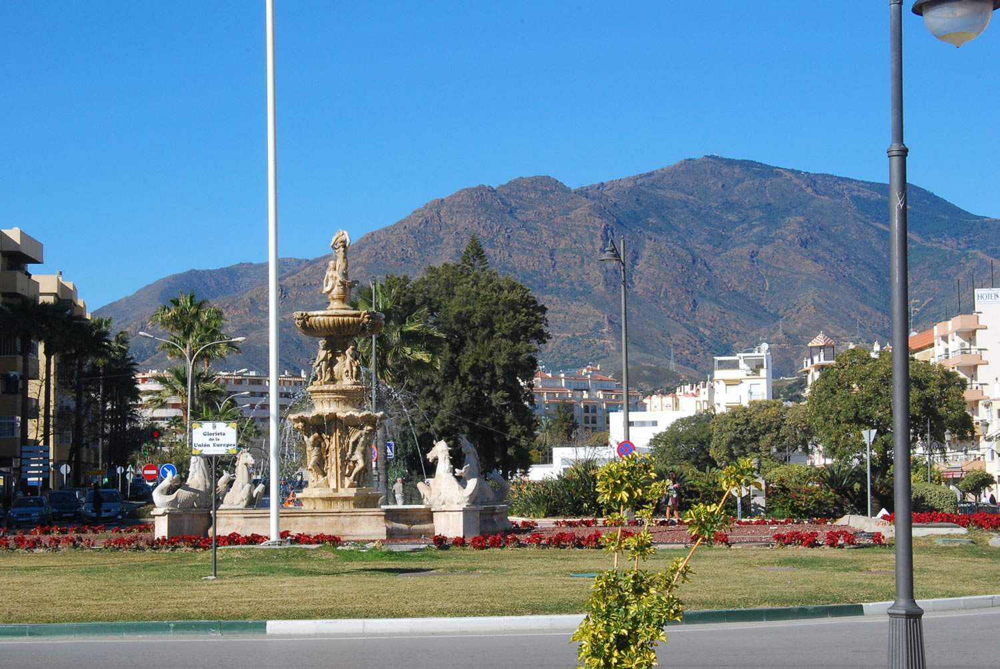
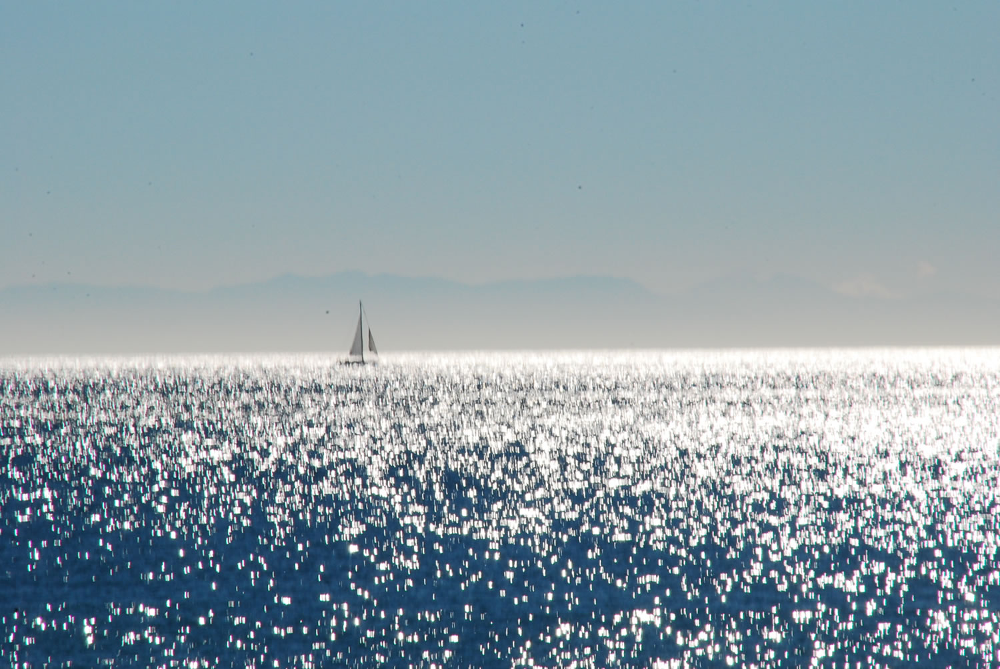
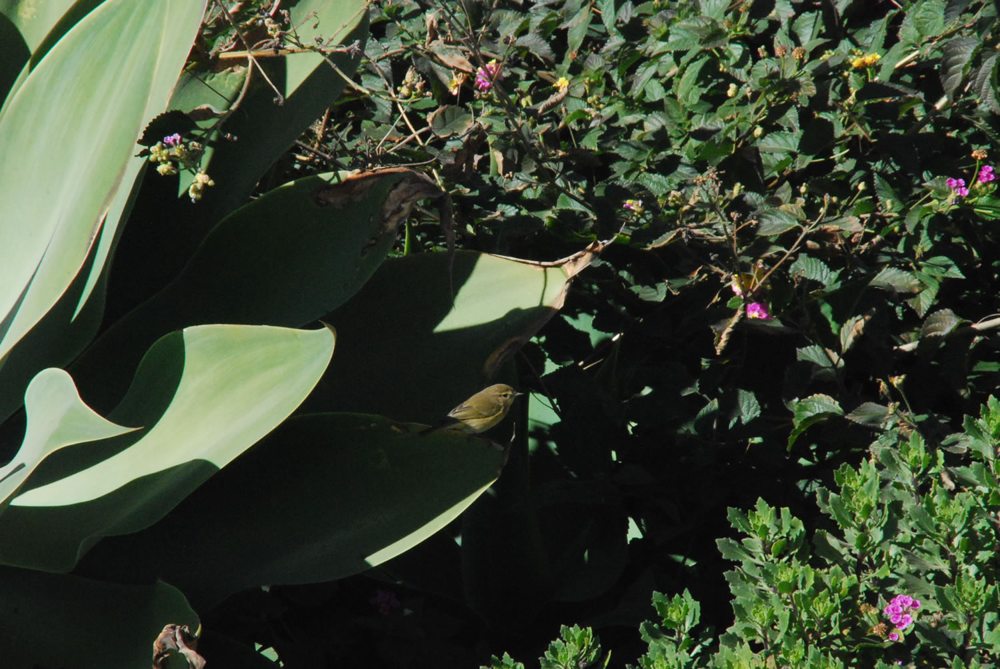

Wonderful late January day in Estepona on Spain's Costa del Sol.
Temperatures were in the high 70'sF.

A walk along the promenade

The Mediterranean was alive with light from the bright winter's sun.

The area is beautifully planted.
This small bird was hopping through the succulents.
I think it might be a Willow Warbler.

