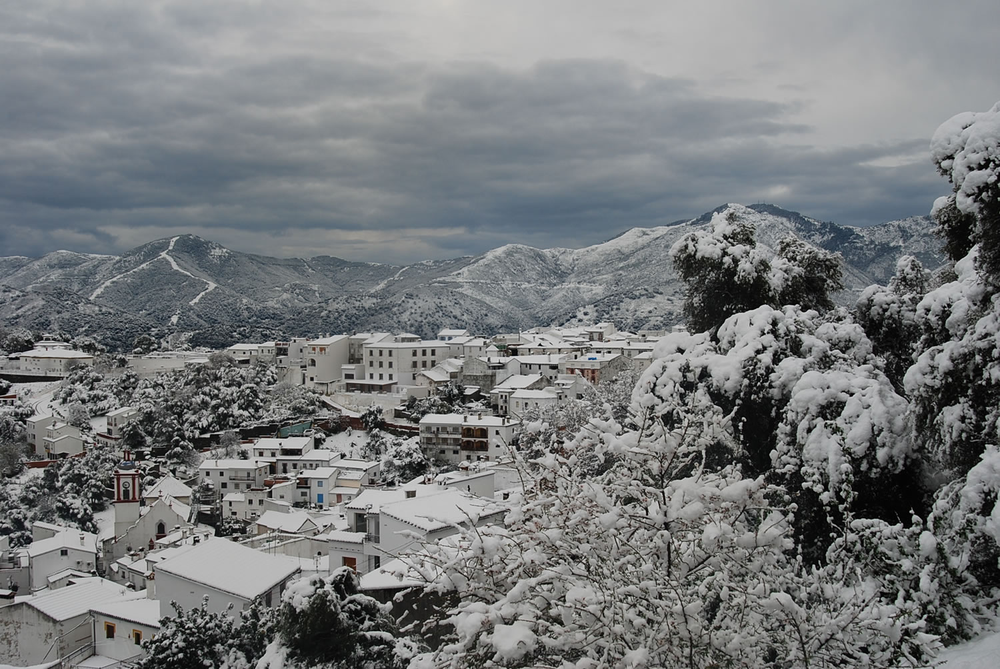
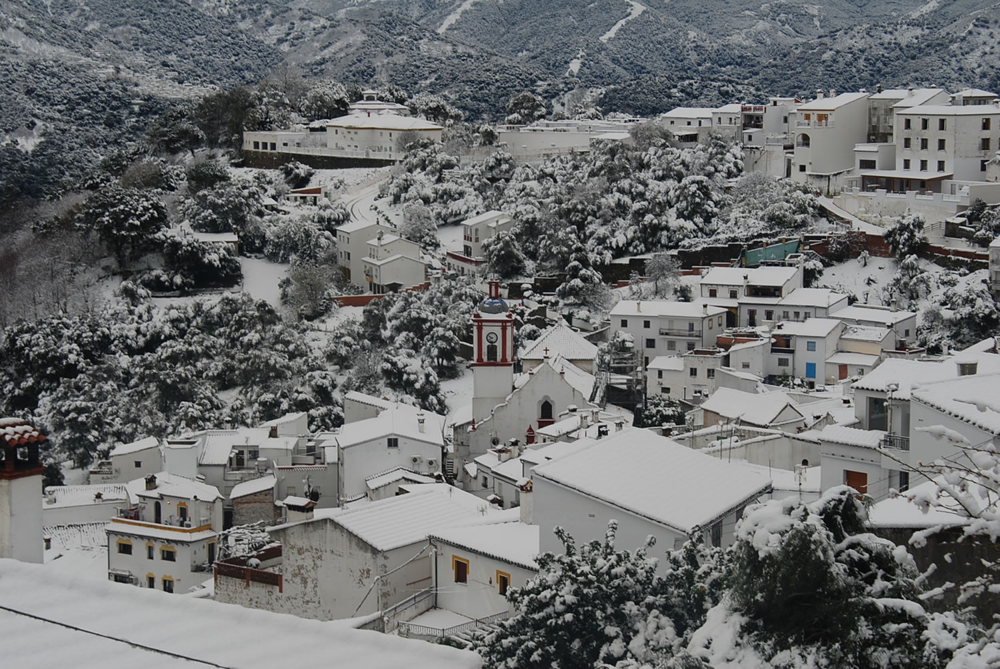
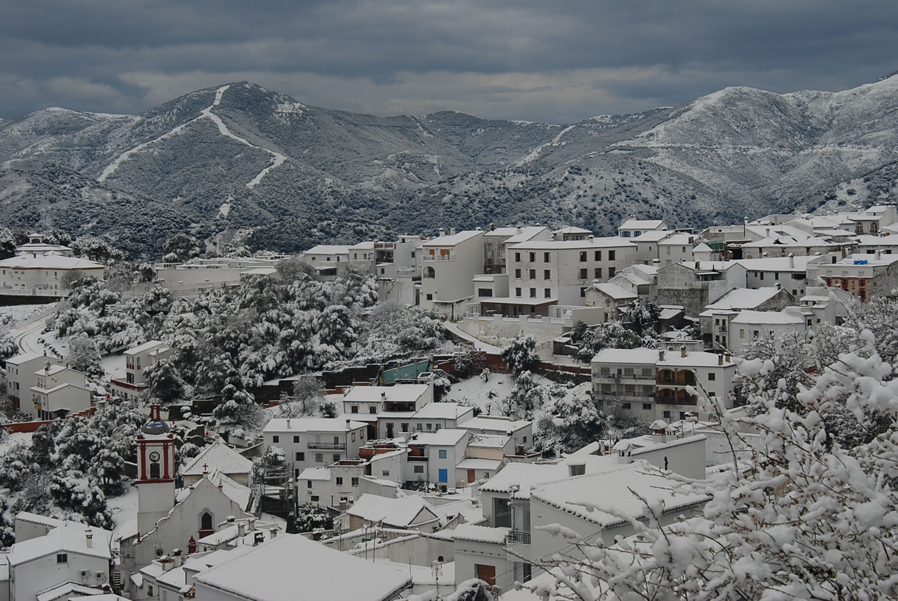
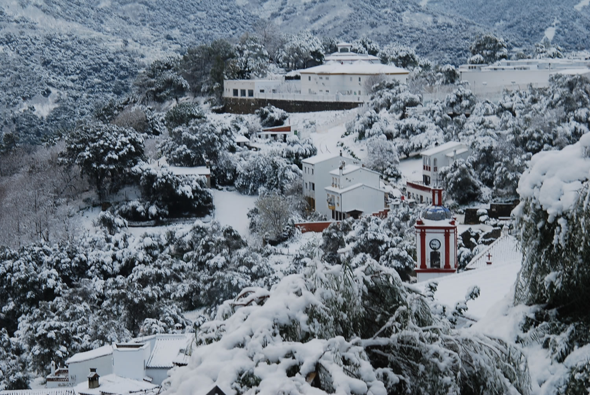
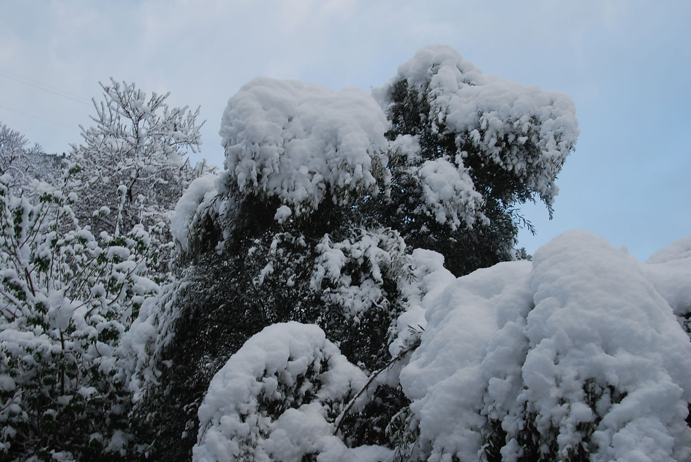
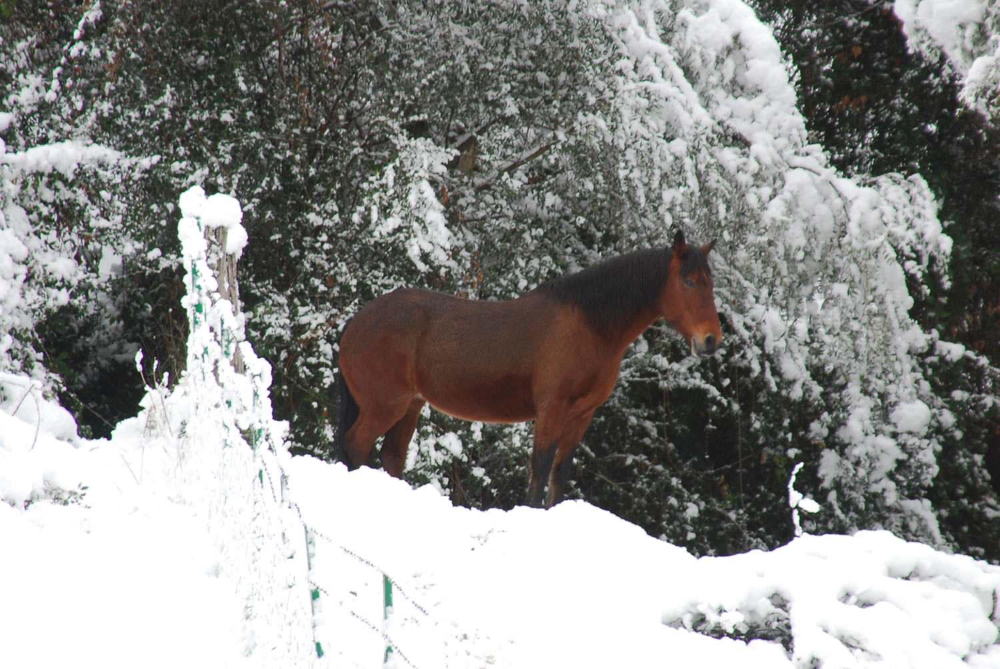
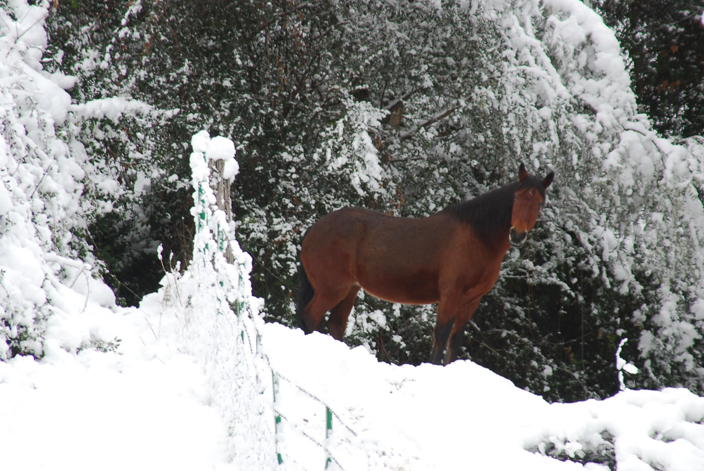

Just days after enjoying the sunshine on the Costa Del Sol. 
Winter hit the Genal Valley in the mountains near Ronda.

The Genal Valley is a special place but looked even more wonderful with a few inches of snow.

The clouds in the distance look threatening although daytime temperatures are above zero.
The Costa del Sol (Estepona) lies on the other side of the mountains on the horizon.
Not too far if you are a crow ... hours on narrow switchback mountain roads.

A scene from a Christmas card?

A lovely mare. She's called Reina. Which translates to Queen.

She spotted me. 

